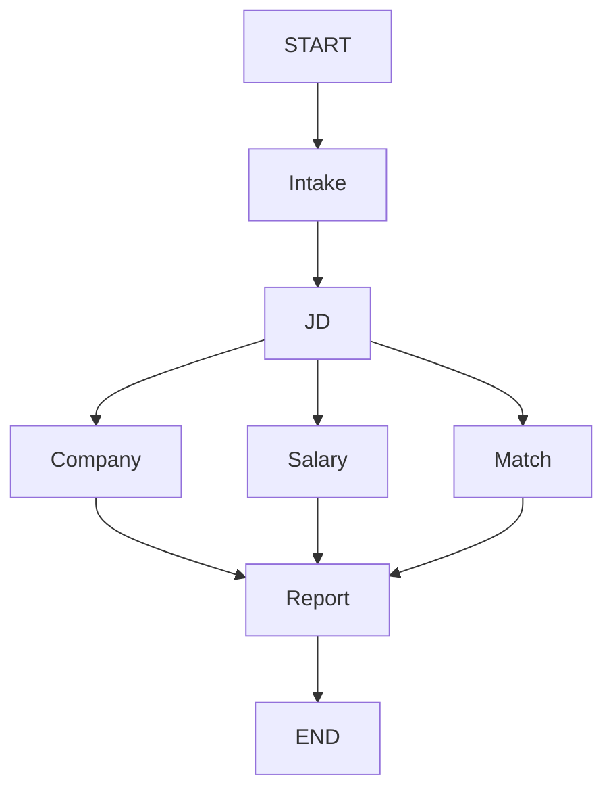
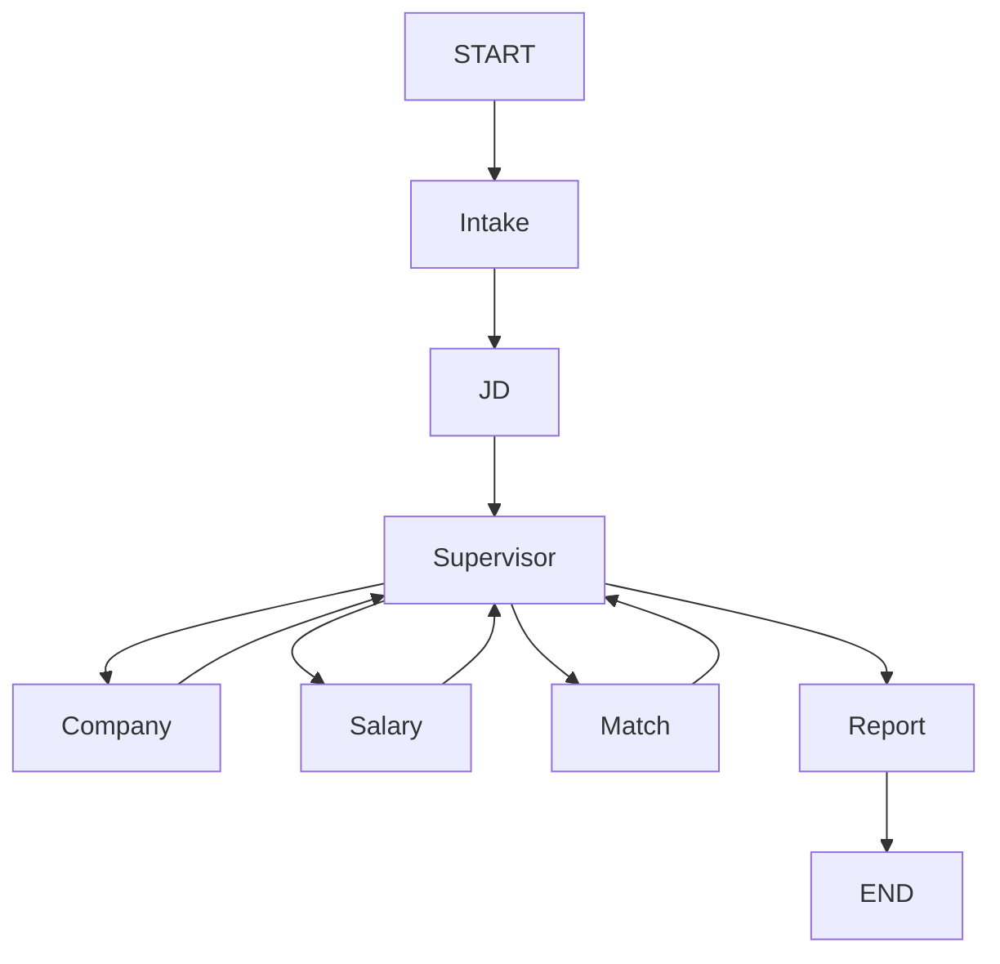

# Job Analysis Agent

一个 LangGraph 学习项目，用显式工作流完成 JD 分析、公司搜索、薪资搜索、候选人匹配和报告生成，并提供用于人工验证的轻量 Web 页面。

## 当前范围

已完成里程碑 1–4：

1. 显式 `StateGraph`、Fixed Router 和 LLM Supervisor Router
2. 可切换的离线模型/OpenAI 模型
3. 一个真实的 stdio 搜索 MCP Server
4. FastAPI、SQLite Checkpointer、账户登录、长期用户资料和分析历史

Hybrid Router 和 Skills 暂未加入，它们属于后续里程碑。

## Web 人工验证

启动服务后访问：

```text
http://localhost:8000/
```

如果使用 Docker，默认地址为：

```text
http://localhost:8001/
```

页面支持注册、登录和右上角用户中心。候选人技能、学历、经验、意向城市、意向岗位和经历摘要按账户独立保存，登录后自动回填，无需每次重新输入。用户中心会列出当前账户的分析历史，点击记录可从 LangGraph checkpoint 恢复完整结果。登录后可以提交 JD、公司和个人资料，并在 Fixed V1 与 LLM V2 之间切换。开发者详情会展示业务节点、Supervisor 决策、耗时、来源与最终报告；Hybrid 选项将在 V3 开放。

当前结果页还会展示规则评分维度、结构化公司画像、薪资样本数与可信度。开发者详情中的端到端耗时是用户实际等待时间；Company、Salary、Match 的节点耗时属于并行工作量，不能直接相加作为等待时间。

## 架构



- `Intake`：校验输入并从 SQLite 恢复用户资料。
- `JD`：使用结构化输出提取岗位要求。
- `Company`：通过 MCP 搜索公司信息。
- `Salary`：通过同一个 MCP 搜索薪资，并由本地工具解析区间。
- `Match`：使用确定性本地评分工具，避免让模型随意生成分数。
- `Report`：只汇总已有结构化事实，不拥有搜索工具。

Company、Salary、Match 在 JD 完成后并行，Report 等待三条分支全部结束。

LLM V2 复用相同业务节点，但在 JD 后通过 Supervisor 动态选择必要节点：



Supervisor 使用结构化输出选择 `company`、`salary`、`match` 或 `report`。最多允许 8 次路由决策，达到上限后强制进入降级报告，避免模型循环。Supervisor 的耗时、Token 和决策理由单独记录，不计入业务路由 Precision。

### 搜索证据约束

MCP 搜索结果在进入结构化提取前会先进行相关性校验：

- 公司事实只接受明确出现目标公司名称或完整公司名称别名的结果。
- 公司搜索结果按句子做实体绑定，每条采纳事实保存对应来源 ID；上市状态、总部等来源冲突时不强行下结论。
- 薪资样本必须同时匹配目标岗位和目标城市；目标公司用于进一步标记公司专属样本。
- 请求可以显式传入 `job_title` 和 `employment_type`；JD 无标题时只为搜索生成带提示的岗位推断。
- 常规社招、校园招聘和实习结果分开过滤，避免不同招聘类型混算。
- 公司专属薪资没有有效样本时，自动降级为同城市同岗位市场薪资，并明确标记数据范围。
- 两阶段搜索的原始标题、链接、返回数和采纳数会保留在结果页，但未采纳结果不进入事实来源。
- 无关结果不会进入最终来源，也不会参与可信度和薪资区间计算。
- 没有合格证据时返回“无法验证/信息不足”；搜索不到不等于公司不存在。
- Report 只能汇总经过过滤的结构化字段，无来源时不得补写公司或薪资事实。
- 外部来源 URL 只接受 HTTP/HTTPS；MCP 初始化有并发锁，搜索调用有超时保护。

## 数据存储

```text
data/checkpoints.db  LangGraph thread 状态和检查点
data/app.db          用户账户、登录会话、thread 归属、分析历史和长期用户资料
```

`app.db` 使用 `PRAGMA user_version` 执行幂等迁移，已有数据库会在启动时自动补齐新字段和索引，无需删除重建。

## 本地启动

要求 Python 3.11+。

```bash
cd job-agent
python -m venv .venv
source .venv/bin/activate
pip install -e ".[dev]"
cp .env.example .env
uvicorn app.main:app --reload --env-file .env
```

如果 `.env` 使用 Docker 内路径 `/app/data/*.db`，本地启动时需要覆盖为项目内路径：

```bash
CHECKPOINT_DB="$PWD/data/checkpoints.db" \
APP_DB="$PWD/data/app.db" \
python -m uvicorn app.main:app --reload --env-file .env
```

默认配置完全离线：

```dotenv
MODEL_BACKEND=mock
SEARCH_BACKEND=static
```

它可以验证图、API 和持久化，但不会返回真实公司及薪资搜索结果。

## 启用真实模型和 MCP 搜索

编辑 `.env`：

```dotenv
MODEL_BACKEND=openai
MODEL_NAME=gpt-4.1-mini
OPENAI_API_KEY=你的OpenAIKey

SEARCH_BACKEND=mcp
TAVILY_API_KEY=你的TavilyKey
SEARCH_TIMEOUT_SECONDS=35
MODEL_TIMEOUT_SECONDS=60
MODEL_MAX_RETRIES=2
```

启动时，Company 和 Salary 节点会通过 `langchain-mcp-adapters` 连接
`app/mcp/servers.json` 中的 stdio Server。Server 的 `web_search` 工具再调用 Tavily。
真实模型超时或请求失败时，JD 与 Report 节点会回退到本地确定性实现，并在执行事件和错误列表中标记为降级，避免整个分析直接失败。

也可以只启用其中一项，例如使用真实 MCP 搜索但保留离线模型：

```dotenv
MODEL_BACKEND=mock
SEARCH_BACKEND=mcp
```

## API

### 注册并保存 Cookie

```bash
curl -c cookies.txt -X POST http://localhost:8001/api/v1/auth/register \
  -H 'Content-Type: application/json' \
  -d '{
    "username": "user_001",
    "email": "user_001@example.com",
    "password": "your-password"
  }'
```

也可以通过 `POST /api/v1/auth/login` 使用用户名/邮箱和密码登录。会话保存在
HttpOnly Cookie 中；默认有效期为 168 小时。连续登录失败默认限制为 5 次/5 分钟。
本地使用 `SESSION_COOKIE_SECURE=false`，部署到 HTTPS 环境时应改为 `true`。

### 创建分析

```bash
curl -b cookies.txt -X POST http://localhost:8001/api/v1/analyze \
  -H 'Content-Type: application/json' \
  -d '{
    "jd_text": "招聘Java后端工程师，要求3年经验，熟悉Java、Spring Boot、MySQL、Redis和Docker，负责核心业务系统设计与开发。",
    "company_name": "示例科技",
    "job_title": "Java后端工程师",
    "employment_type": "social",
    "question": "分析岗位匹配度和预计薪资",
    "target_location": "上海",
    "router_mode": "fixed",
    "user_profile": {
      "preferred_locations": ["上海", "江苏", "浙江"],
      "preferred_roles": ["Java后端", "金融科技"],
      "skills": ["Java", "Spring Boot", "MySQL", "Redis", "MQ"],
      "education": "UNSW IT硕士",
      "years_of_experience": 3
    }
  }'
```

第一次分析必须提交 `user_profile`。API 会将它保存到 `app.db`；同一登录账户之后
可以省略该字段。`user_id` 不再由客户端提交，而是从登录会话中取得。

响应包含服务端生成的 `thread_id`、匹配结果、公司信息、薪资信息、来源、最终报告和完整路由历史。客户端不能指定 `thread_id`，避免跨用户操作其他检查点。

将 `router_mode` 改为 `llm` 即可启用 V2。只询问公司时，典型链路为 `intake → jd → company → report`；未执行的薪资和匹配结果返回 `null`。`router_decisions` 会记录 Supervisor 每次选择及其理由。

### 候选人资料

```text
GET /api/v1/profile
PUT /api/v1/profile
```

资料与当前登录账户绑定。分析请求提交 `user_profile` 时也会同步更新这份长期资料；后续登录页面会自动读取并回填。

### 恢复 thread 状态

```bash
curl -b cookies.txt http://localhost:8001/api/v1/threads/<thread_id>
```

thread 与创建它的账户绑定，其他登录用户无法读取。

### 分析历史

```text
GET /api/v1/analyses?limit=20
```

只返回当前登录账户的记录，包含公司、岗位、匹配分、建议和更新时间。前端用户中心会使用该接口，并通过 thread 恢复接口打开历史结果。

### 健康检查与接口文档

```text
GET /health
GET /docs
```

Docker 默认映射到宿主机 `8001`；直接运行 Uvicorn 时默认仍是 `8000`。
可以通过 `.env` 中的 `API_PORT` 修改 Docker 宿主端口。

## Docker

```bash
cd job-agent
cp .env.example .env
docker compose up --build
```

SQLite 文件保存在宿主机的 `job-agent/data/`。
Dockerfile 启用了 BuildKit 的 pip 缓存；首次构建仍需下载依赖，之后即使应用代码变化，也可复用已下载的 wheel。

## 测试

测试不调用真实 LLM，也不访问公网：

```bash
ruff check app tests
node --check app/web/app.js
pytest -q
```

GitHub Actions 会自动执行以上检查并验证 Docker 镜像能够构建。Web 资源拆分为 `index.html`、`styles.css` 和 `app.js`，由 FastAPI 的 `/assets` 路径提供。

覆盖内容：

- 六个节点完整执行
- Company 和 Salary 并行执行
- LLM Supervisor 按问题选择节点并跳过无关 Agent
- Supervisor 最大决策次数与降级保护
- MCP 搜索失败后的降级报告
- 无关搜索结果的实体与岗位相关性过滤
- 本地匹配和薪资工具
- SQLite 用户资料读写
- 注册、登录、退出、Cookie 会话和用户隔离
- FastAPI 分析与 thread 恢复
- SQLite 迁移幂等性、旧版本升级和用户分析历史
- 真实模型失败时的 JD/Report 降级
- Web 页面入口和 API 指标字段
- 评估数据集与路由指标计算

## 路由评估基线

`evaluations/cases.json` 保存 20 条 Router 无关的固定测试用例。每条用例可以标注理想情况下最少需要执行的 Agent、禁止调用的 Agent，以及针对嵌套输出字段的 Gold Label 断言，因此可以公平比较 Fixed、LLM 和 Hybrid，而不是为 Fixed 单独降低标准。

运行当前 Fixed 基线：

```bash
python -m app.evaluation.runner
```

运行 LLM V2 的零成本 Mock 基线：

```bash
python -m app.evaluation.runner \
  --router llm \
  --model-backend mock \
  --output evaluations/results/llm.jsonl
```

默认每条用例只运行一轮，并使用 Mock 模型与固定搜索快照，不产生 API 费用。控制台会输出任务成功率、路由 Precision/Recall/F1、完全匹配率、禁止 Agent 违规率、Gold Label 准确率、公司事实来源覆盖率、P50/P95 延迟、输入/输出 Token、模型调用次数及估算费用；逐条结果写入 `evaluations/results/fixed.jsonl`，该运行产物默认不提交 Git。

真实模型评估必须显式确认，并可设置预算上限：

```bash
python -m app.evaluation.runner \
  --model-backend openai \
  --model-name gpt-4.1-mini \
  --confirm-live \
  --repeats 1 \
  --max-cost-usd 2
```

`--max-cost-usd` 会在每条用例结束后根据实际 Token 估价，并在下一条用例开始前检查预算，因此最多可能超出单条用例的费用。中断后增加 `--resume` 可跳过已经完成的“用例 + 轮次 + Router”组合。价格会变化，可通过 `--input-price-per-million` 和 `--output-price-per-million` 按当前模型价格覆盖默认值。

主要指标：

- `task_success_rate`：要求的输出字段和来源是否完整。
- `route_precision`：实际执行的 Agent 调用中有多少是必要的，重复调用也会降低该指标。
- `route_recall`：必要 Agent 是否都被执行。
- `route_f1`：综合衡量路由精确率与召回率。
- `exact_route_match`：实际与理想 Agent 调用次数是否完全一致。
- `assertion_accuracy`：结构化结果满足人工 Gold Label 的比例，不再只检查字段是否存在。
- `grounded_claim_rate`：公司事实中来源 ID 能对应到有效来源的比例。
- `forbidden_agent_violation_rate`：执行了用例明确禁止的无关 Agent 的比例。
- `total_latency_ms`：端到端真实等待时间，不将并行节点耗时相加。
- `token_usage`：JD 与 Report 模型调用返回的真实 Token 总量。
