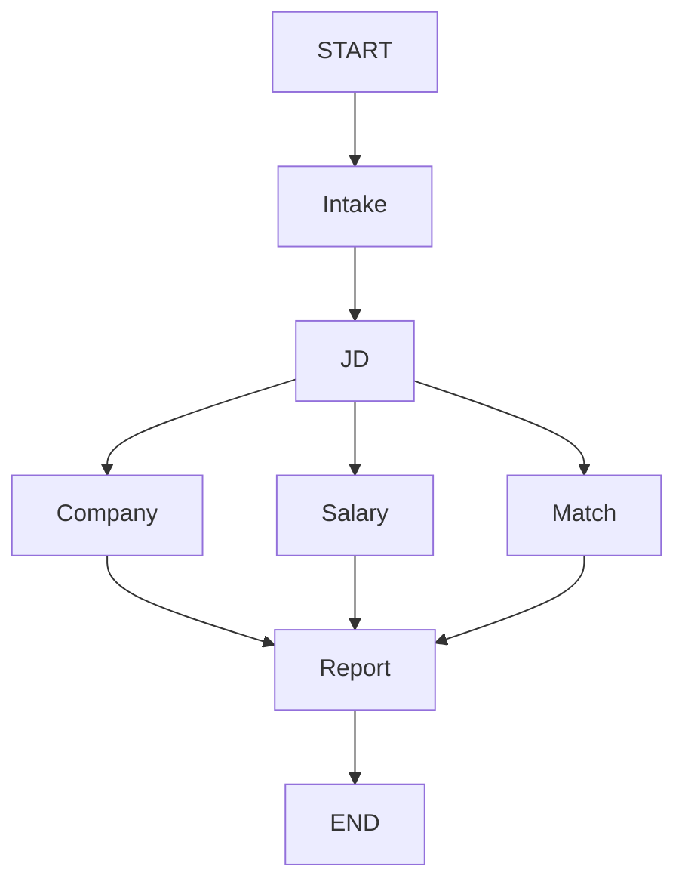

# Job Analysis Agent

一个只包含后端的学习项目，用显式 LangGraph 工作流完成 JD 分析、公司搜索、薪资搜索、候选人匹配和报告生成。

## 当前范围

已完成里程碑 1–4：

1. 显式 `StateGraph` 和 Fixed Router
2. 可切换的离线模型/OpenAI 模型
3. 一个真实的 stdio 搜索 MCP Server
4. FastAPI、SQLite Checkpointer 和长期用户资料

Hybrid Router、LLM Router 和 Skills 暂未加入，它们属于后续里程碑。

## 架构



- `Intake`：校验输入并从 SQLite 恢复用户资料。
- `JD`：使用结构化输出提取岗位要求。
- `Company`：通过 MCP 搜索公司信息。
- `Salary`：通过同一个 MCP 搜索薪资，并由本地工具解析区间。
- `Match`：使用确定性本地评分工具，避免让模型随意生成分数。
- `Report`：只汇总已有结构化事实，不拥有搜索工具。

Company、Salary、Match 在 JD 完成后并行，Report 等待三条分支全部结束。

## 数据存储

```text
data/checkpoints.db  LangGraph thread 状态和检查点
data/app.db          跨 thread 的用户资料
```

## 本地启动

要求 Python 3.11+。

```bash
cd job-agent
python -m venv .venv
source .venv/bin/activate
pip install -e ".[dev]"
cp .env.example .env
uvicorn app.main:app --reload --env-file .env
```

默认配置完全离线：

```dotenv
MODEL_BACKEND=mock
SEARCH_BACKEND=static
```

它可以验证图、API 和持久化，但不会返回真实公司及薪资搜索结果。

## 启用真实模型和 MCP 搜索

编辑 `.env`：

```dotenv
MODEL_BACKEND=openai
MODEL_NAME=gpt-4.1-mini
OPENAI_API_KEY=你的OpenAIKey

SEARCH_BACKEND=mcp
TAVILY_API_KEY=你的TavilyKey
```

启动时，Company 和 Salary 节点会通过 `langchain-mcp-adapters` 连接
`app/mcp/servers.json` 中的 stdio Server。Server 的 `web_search` 工具再调用 Tavily。

也可以只启用其中一项，例如使用真实 MCP 搜索但保留离线模型：

```dotenv
MODEL_BACKEND=mock
SEARCH_BACKEND=mcp
```

## API

### 创建分析

```bash
curl -X POST http://localhost:8001/api/v1/analyze \
  -H 'Content-Type: application/json' \
  -d '{
    "user_id": "user_001",
    "jd_text": "招聘Java后端工程师，要求3年经验，熟悉Java、Spring Boot、MySQL、Redis和Docker，负责核心业务系统设计与开发。",
    "company_name": "示例科技",
    "question": "分析岗位匹配度和预计薪资",
    "target_location": "上海",
    "router_mode": "fixed",
    "user_profile": {
      "preferred_locations": ["上海", "江苏", "浙江"],
      "preferred_roles": ["Java后端", "金融科技"],
      "skills": ["Java", "Spring Boot", "MySQL", "Redis", "MQ"],
      "education": "UNSW IT硕士",
      "years_of_experience": 3
    }
  }'
```

第一次分析必须提交 `user_profile`。API 会将它保存到 `app.db`；同一个 `user_id`
之后可以省略该字段。

响应包含 `thread_id`、匹配结果、公司信息、薪资信息、来源、最终报告和完整路由历史。

### 恢复 thread 状态

```bash
curl http://localhost:8001/api/v1/threads/<thread_id>
```

### 健康检查与接口文档

```text
GET /health
GET /docs
```

Docker 默认映射到宿主机 `8001`；直接运行 Uvicorn 时默认仍是 `8000`。
可以通过 `.env` 中的 `API_PORT` 修改 Docker 宿主端口。

## Docker

```bash
cd job-agent
cp .env.example .env
docker compose up --build
```

SQLite 文件保存在宿主机的 `job-agent/data/`。

## 测试

测试不调用真实 LLM，也不访问公网：

```bash
pytest
```

覆盖内容：

- 六个节点完整执行
- Company 和 Salary 并行执行
- MCP 搜索失败后的降级报告
- 本地匹配和薪资工具
- SQLite 用户资料读写
- FastAPI 分析与 thread 恢复
